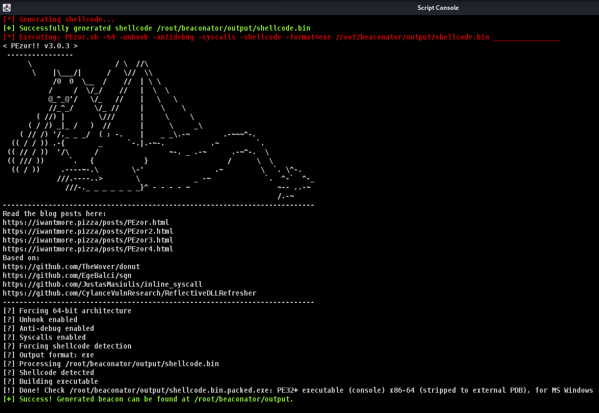

# Beaconator
[](https://github.com/capt-meelo/Beaconator/releases)
[](https://github.com/capt-meelo/Beaconator/blob/main/LICENSE)
[](https://github.com/capt-meelo/Beaconator/issues?q=is:issue+is:open)

Beaconator is an aggressor script for Cobalt Strike used to generate a raw **stageless** shellcode and packing the generated shellcode using [PEzor](https://github.com/phra/PEzor).


## How to Use
**Installing PEzor**

[PEzor](https://github.com/phra/PEzor) is required so install it first using the following:
```
git clone https://github.com/phra/PEzor.git
cd PEzor
./install.sh
```
> ***NOTE:** Make sure to add PEzor's `$PATH` variable in your `~/.profile` or `~/.bashrc` (if using Bash), **OR** `~/.zprofile` or `~/.zshrc` (if using ZSH).*


**Running Beaconator**

1. Load the `beaconator.cna` file via `Cobalt Strike > Script Manager`.
2. Access Beaconator from the menu bar.


## Screenshots

 

 


## Credits
- To **Francesco Soncina** ([@phraaaaaaa](https://twitter.com/phraaaaaaa)) for developing the awesome [PEzor](https://github.com/phra/PEzor).
