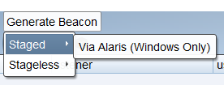
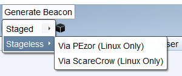
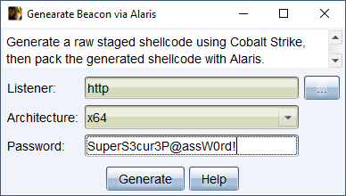
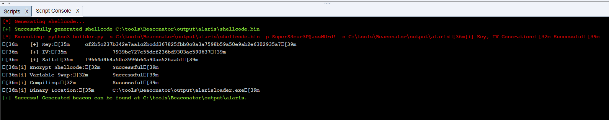
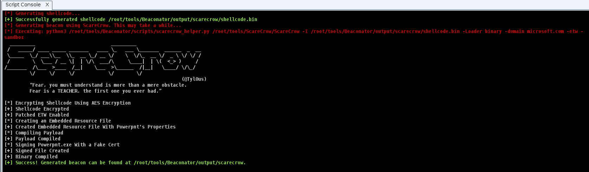

# Beaconator
[](https://github.com/capt-meelo/Beaconator/releases)
[](https://github.com/capt-meelo/Beaconator/blob/main/LICENSE)
[](https://github.com/capt-meelo/Beaconator/issues)
[](https://github.com/capt-meelo/Beaconator/stargazers)
[](https://github.com/capt-meelo/Beaconator/network)

Beaconator is an aggressor script for Cobalt Strike used to generate either **staged** or **stageless** shellcode and packing the generated shellcode using your tool of choice. 

Currently, it supports the following tools:

**Staged Beacon Generator**
- [Alaris](https://github.com/cribdragg3r/Alaris)

**Stageless Beacon Generator**
- [PEzor](https://github.com/phra/PEzor) 
- [ScareCrow](https://github.com/optiv/ScareCrow)


# How to Use
## Beaconator
1. Load the `beaconator.cna` file via `Cobalt Strike > Script Manager`.
2. Access Beaconator from the menu bar by clicking the `Generate Beacon` menu.

## Staged Beacon Generator
### Alaris
1. Clone the repo.
```
git clone https://github.com/cribdragg3r/Alaris.git
```
2. Open `beaconator.cna` and change the value of the `$ALARIS_DIR` variable and point it to where **Alaris** is located.


## Stageless Beacon Generator
### PEzor
1. Install **PEzor** using the following:
```
git clone https://github.com/phra/PEzor.git
cd PEzor
./install.sh
```
2. Add PEzor's `$PATH` variable in your `~/.profile` or `~/.bashrc` (if using Bash), **OR** `~/.zprofile` or `~/.zshrc` (if using ZSH).

### ScareCrow
1. Install the dependencies.
```
sudo apt update -y && sudo apt install -y openssl osslsigncode mingw-w64
go get github.com/fatih/color
go get github.com/yeka/zip
go get github.com/josephspurrier/goversioninfo
```
2. Clone the repo and build ScareCrow.
```
git clone https://github.com/optiv/ScareCrow.git
cd ScareCrow
go build ScareCrow.go
```
3. Open `beaconator.cna` and change the value of the `$SCARECROW_DIR` variable and point it to where **ScareCrow** is located.


# Screenshots
### Beaconator
  

### Alaris
 
 

### PEzor
 
 

### ScareCrow
 
 


## Credits
- [@JFaust_](https://twitter.com/JFaust_) for developing [Alaris](https://github.com/cribdragg3r/Alaris).
- [@phraaaaaaa](https://twitter.com/phraaaaaaa/) for developing [PEzor](https://github.com/phra/PEzor).
- [@Tyl0us](https://twitter.com/Tyl0us) for developing [ScareCrow](https://github.com/optiv/ScareCrow).